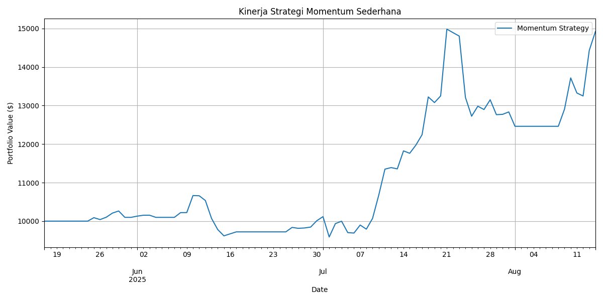

# Sistem Trading Kuantum & Klasik

Proyek ini mengimplementasikan, menguji, dan membandingkan strategi trading algoritmik menggunakan arsitektur modular di Python. Sistem ini dirancang untuk fleksibilitas, memungkinkan perbandingan berbagai model prediksi dan metode optimisasi (baik klasik maupun kuantum).

## Arsitektur Proyek

Proyek ini telah direfaktor menjadi arsitektur modular yang bersih untuk memisahkan berbagai komponen logis:

-   **/src**: Berisi semua logika inti.
    -   `/ingestion`: Mengambil data harga (dengan sistem cache).
    -   `/models`: Model prediksi (misalnya, momentum).
    -   `/optimizer`: Logika pemilihan aset/portofolio.
    -   `/backtest`: Mesin untuk menjalankan backtest dan menghitung metrik.
-   **/configs**: File konfigurasi terpusat untuk parameter.
-   **/data**: Direktori untuk data mentah dan cache.
-   **/tools**: Skrip untuk menjalankan alur kerja, seperti `run_backtest.py`.
-   **/.venv**: Lingkungan virtual Python untuk mengelola dependensi.

## Cara Menjalankan

1.  **Siapkan Lingkungan**: Pastikan Anda memiliki Python dan telah membuat lingkungan virtual.
    ```bash
    python -m venv .venv
    ```

2.  **Aktifkan Lingkungan**:
    -   **Windows (PowerShell)**:
        ```powershell
        .\.venv\Scripts\Activate.ps1
        ```
    -   **macOS/Linux**:
        ```bash
        source .venv/bin/activate
        ```

3.  **Instal Dependensi**:
    ```bash
    pip install -r requirements.txt
    ```

4.  **Jalankan Backtest**: Untuk menjalankan simulasi lengkap, gunakan skrip `run_backtest.py`.
    ```bash
    python tools/run_backtest.py
    ```
    Skrip akan mengambil data (menggunakan cache jika tersedia), menjalankan prediksi, memilih aset, melakukan backtest, dan menampilkan hasil serta grafik kinerja.

## Hasil Terbaru: Strategi Momentum Sederhana (5 Aset)

Berikut adalah hasil dari backtest terbaru yang dijalankan pada 5 aset (`bitcoin`, `ethereum`, `solana`, `cardano`, `dogecoin`) menggunakan strategi momentum sederhana.

-   **Nilai Akhir Portofolio**: `$14,924.84`
-   **Sharpe Ratio Tahunan**: `2.63`
-   **Maximum Drawdown**: `-16.84%`



*(Catatan: Anda mungkin perlu menghasilkan gambar baru dengan nama file yang sesuai untuk mencerminkan hasil ini.)*
