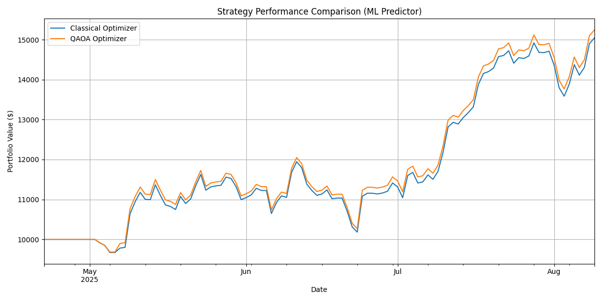
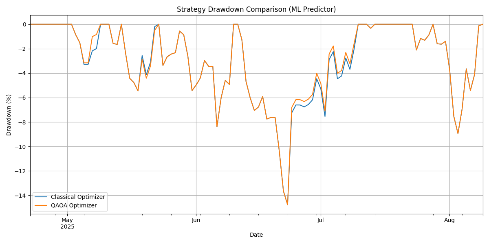

# Quantum Trading System

Proyek ini mengimplementasikan dan membandingkan strategi trading menggunakan optimizer klasik dan optimizer kuantum (QAOA) untuk pemilihan aset kripto.

---

## Hasil Terbaik (ML Predictor, QAOA reps=1)

Konfigurasi berikut memberikan kinerja terbaik setelah serangkaian eksperimen, menggunakan prediktor Machine Learning (Logistic Regression) dan kedalaman sirkuit QAOA `reps=1`.

### Metrik Kinerja (per 2025-08-09)

| Metric             | Classical Optimizer | QAOA Optimizer |
|--------------------|---------------------|----------------|
| **Final Value**    | $15,044.21          | $15,268.51     |
| **Sharpe Ratio**   | 2.75                | 2.83           |
| **Max Drawdown**   | -14.76%             | -14.76%        |

### Grafik Performa

---

## Log Eksperimen & Temuan

1.  **Visualisasi Risiko:** Menambahkan plot *Drawdown Over Time* memberikan wawasan visual tentang profil risiko. Terlihat bahwa meskipun QAOA memberikan return lebih tinggi, ia juga mengalami drawdown yang sedikit lebih dalam di beberapa titik.
2.  **Feature Engineering (Momentum):** Eksperimen dengan menambahkan fitur `momentum_10` ke prediktor ML ternyata **menurunkan kinerja**. Sharpe Ratio turun dan Max Drawdown meningkat. Ini menunjukkan bahwa tidak semua fitur tambahan bersifat membantu.
3.  **Parameter Tuning QAOA (reps=2):** Eksperimen dengan meningkatkan kedalaman sirkuit QAOA menjadi `reps=2` juga **menurunkan kinerja**. Ini menunjukkan bahwa untuk masalah ini, sirkuit yang lebih kompleks mungkin "overfit" pada sinyal prediksi yang tidak sempurna, dan `reps=1` memberikan keseimbangan yang lebih baik.

---

## Arsip Hasil Terdahulu

### Hasil Awal (Prediktor Moving Average)

*   **Run 1:** Klasik: $12,938.80, QAOA: $13,504.94
*   **Run 2:** Klasik: $12,938.80, QAOA: $11,304.30