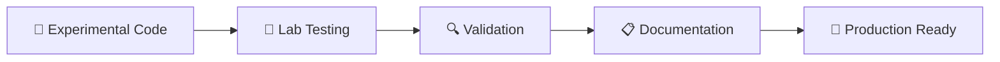
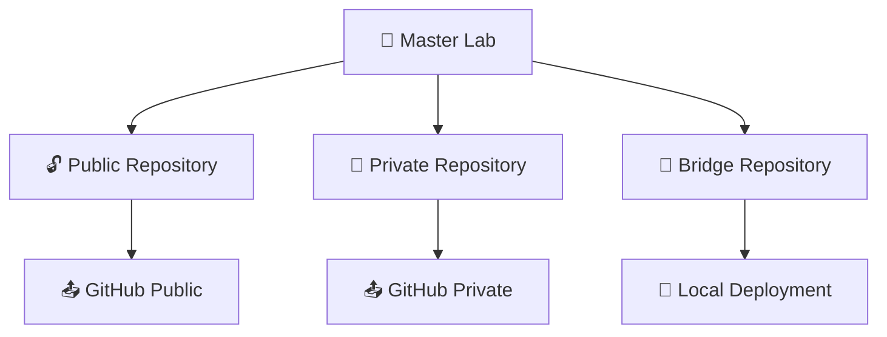
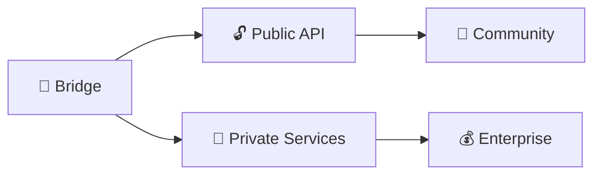

# 🧠 MASTER DEV LAB - Quantum AI Trading System

> **"The Secret Brain"** - Central R&D and Development Laboratory

**⚠️ CONFIDENTIAL: This is NOT production. This is your master development environment.**

---

## 🎯 **Lab Purpose & Philosophy**

This workspace serves as the **Master Development Laboratory** for the Quantum AI Trading System dual-repository architecture. It's where all the magic happens before being properly separated into public and private repositories.

### **Core Functions:**
- 🧪 **R&D Laboratory**: Experimental algorithms and quantum simulations
- 🏗️ **Sandbox Environment**: Test new features before deployment
- 📋 **Staging Area**: Prepare code for public/private repository distribution
- 🔧 **Bridge Testbed**: Validate secure communication protocols
- 📚 **Architecture Repository**: Complete documentation and blueprints
- 🧠 **Central Intelligence**: Master brain of the entire operation

---

## 🏗️ **Architecture Overview**

```
                        🧠 MASTER DEV LAB
                              │
        ┌─────────────────────┼─────────────────────┐
        │                     │                     │
   🔓 PUBLIC             🔐 PRIVATE             🌉 BRIDGE
   (Glass House)         (Vault)             (Secure Gateway)
   │                     │                     │
   ✅ GitHub Public      ✅ GitHub Private     ✅ Local Deployment
   👥 Community          🔒 Secure             🛡️ Authentication
   📚 Education          💰 Proprietary        🔍 Sanitization
```

---

## 📁 **Directory Structure**

```
quantum_trading_system/
├── 🧠 MASTER DEV LAB OVERVIEW
│   ├── 📖 README.md (this file)
│   ├── 🚀 DEPLOYMENT-GUIDE.md
│   └── 📊 ARCHITECTURE-ANALYSIS.md
│
├── 📋 DOCUMENTATION & GUIDES
│   ├── 📚 docs/
│   │   ├── 📖 comprehensive project documentation
│   │   ├── 🎯 implementation guides
│   │   ├── 🏗️ architecture specifications
│   │   └── 🔧 deployment procedures
│   │
│   ├── 🌉 bridge-specific documentation
│   ├── 📋 migration guides
│   └── 🔒 compliance frameworks
│
├── 🏗️ IMPLEMENTATION REPOSITORIES
│   ├── 🔓 public-quantum-trading/
│   │   └── 📝 Public-facing infrastructure
│   │
│   ├── 🔐 private-quantum-vault/
│   │   └── 🔒 Proprietary algorithms (PRIVATE on GitHub)
│   │
│   └── 🌉 api-bridge/
│       └── 🛡️ Secure gateway implementation
│
└── 🧪 EXPERIMENTAL & DEVELOPMENT
    ├── 🧬 prototype algorithms
    ├── 🧪 testing frameworks
    ├── 📊 performance benchmarks
    └── 🔬 quantum simulations
```

---

## 🔄 **Development Workflow**

### **Phase 1: Experimental Development**


### **Phase 2: Repository Separation**


### **Phase 3: Production Deployment**


---

## 🧪 **Lab Usage Guidelines**

### **For Experimental Development:**
1. **Create experimental branches** for new algorithms
2. **Document everything** - this is your knowledge base
3. **Test extensively** before repository separation
4. **Maintain clear separation** between proven and experimental code

### **For Repository Management:**
1. **Develop here first** - master implementation
2. **Separate to public/private** when ready
3. **Keep bridge synchronized** with both repositories
4. **Document all changes** for future reference

### **For Bridge Testing:**
1. **Test all new features** through the bridge
2. **Validate security layers** before production
3. **Benchmark performance** regularly
4. **Update documentation** as architecture evolves

---

## 🔐 **Security Classification**

### **Security Levels:**
- 🔓 **PUBLIC**: Ready for GitHub public repository
- 🔒 **PRIVATE**: Reserved for GitHub private repository
- 🌉 **BRIDGE**: Secure gateway components
- 🧠 **LAB**: Development and experimental code

### **Access Control:**
- **Master Lab**: Full access, no restrictions
- **Public Repository**: Community-facing, sanitized
- **Private Repository**: Proprietary, secure access only
- **Bridge Repository**: Security-critical, restricted

---

## 📊 **Lab Metrics & Monitoring**

### **Development Metrics:**
- 🧪 **Experimental Features**: [Current count]
- 🔄 **Repository Synchronizations**: [Last sync date]
- 📊 **Performance Benchmarks**: [Latest results]
- 🔒 **Security Validations**: [Last audit]

### **Repository Status:**
- 🔓 **Public Repository**: ✅ Deployed
- 🔐 **Private Repository**: ✅ Deployed  
- 🌉 **Bridge Repository**: ✅ Ready

---

## 🛠️ **Getting Started in the Lab**

### **New Developer Onboarding:**
1. **Read Architecture Overview** - Understand the dual-repo strategy
2. **Study Bridge Documentation** - Learn secure communication patterns
3. **Review Repository Separation** - Know what goes where
4. **Set Up Development Environment** - Configure tools and access

### **Feature Development Process:**
1. **Experiment in Lab** - Develop and test thoroughly
2. **Document Implementation** - Update architecture docs
3. **Security Review** - Validate through bridge testing
4. **Repository Separation** - Split to public/private as appropriate
5. **Deployment Validation** - Test end-to-end functionality

---

## 🚨 **Lab Rules & Guidelines**

### **DO:**
- ✅ **Document everything** for future reference
- ✅ **Test extensively** before repository separation
- ✅ **Keep security in mind** at all times
- ✅ **Maintain clean separation** between public/private code
- ✅ **Use this as your primary development environment**

### **DON'T:**
- ❌ **Deploy directly to production** from this lab
- ❌ **Commit sensitive data** to public repositories
- ❌ **Skip security testing** before repository separation
- ❌ **Ignore documentation** updates
- ❌ **Mix experimental and production code**

---

## 🎯 **Success Metrics**

### **Lab Effectiveness:**
- **Development Velocity**: Speed of feature development
- **Code Quality**: Security and performance standards
- **Documentation Coverage**: Completeness of guides
- **Repository Synchronization**: Alignment with GitHub repos

### **Architecture Integrity:**
- **Dual-Repo Compliance**: Proper separation maintained
- **Bridge Security**: Authentication and sanitization working
- **Performance Standards**: Meets latency and throughput targets
- **Documentation Accuracy**: Reflects actual implementation

---

## 🔗 **Repository Links**

- 🔓 **Public Repository**: [GitHub Link]
- 🔐 **Private Repository**: [GitHub Link] (Private)
- 🌉 **Bridge Repository**: Local development

---

## 📞 **Lab Support & Maintenance**

### **Regular Maintenance:**
- **Weekly**: Update documentation and sync with repositories
- **Monthly**: Security audit and performance benchmarking
- **Quarterly**: Architecture review and optimization
- **Annually**: Complete system overhaul and modernization

### **Getting Help:**
- **Architecture Questions**: Review documentation and guides
- **Security Concerns**: Validate through bridge testing
- **Performance Issues**: Run benchmarks and optimization
- **Repository Issues**: Check separation compliance

---

**🎉 Welcome to the Master Dev Lab - where innovation meets security, and transparency protects intelligence!**

---

*Master Dev Lab - Central Intelligence Hub*  
*Last Updated: 2025-10-31T19:09:23.969Z*  
*Classification: CONFIDENTIAL - Development Only*