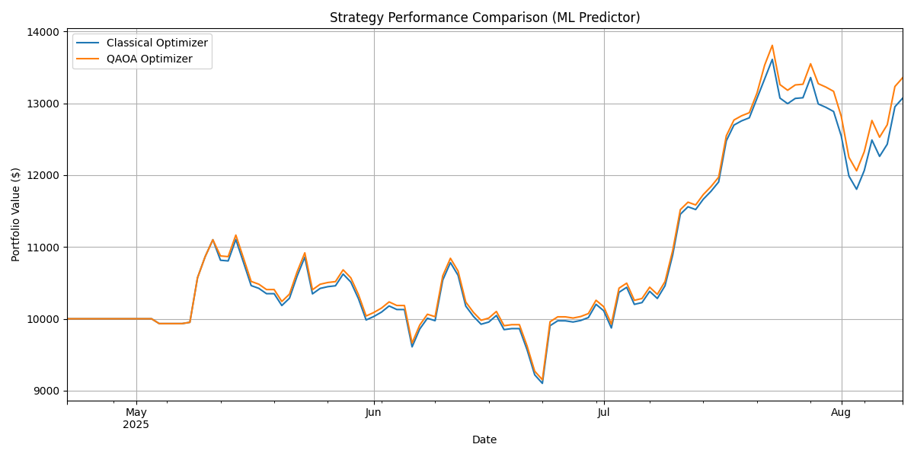
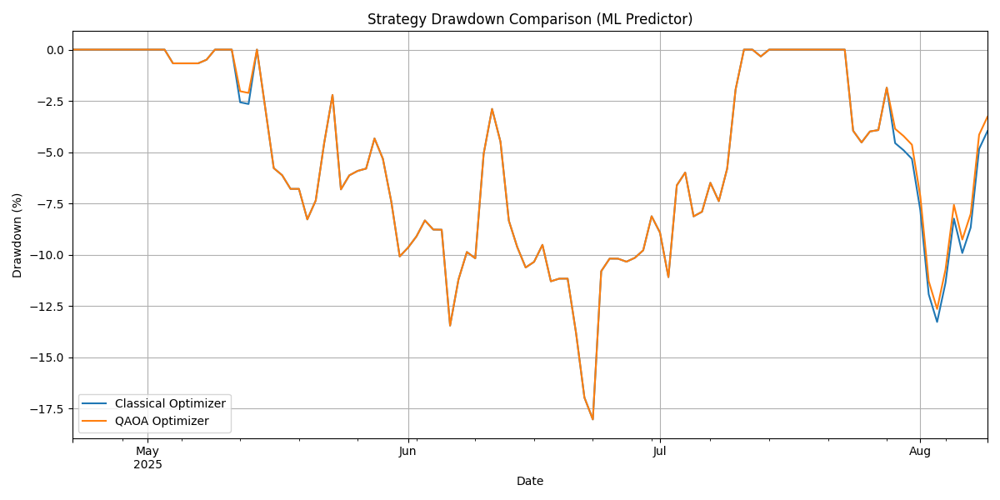

# Quantum Trading System

Proyek ini mengimplementasikan dan membandingkan strategi trading menggunakan optimizer klasik dan optimizer kuantum (QAOA) untuk pemilihan aset kripto.

---

## Hasil Terbaru: Strategi Hibrid dengan Model Risiko Markowitz (5 Aset)

Ini adalah hasil dari konfigurasi sistem yang paling canggih, diuji pada 5 aset (`bitcoin`, `ethereum`, `solana`, `cardano`, `dogecoin`).

*   **Strategi Klasik:** Menggunakan optimizer eksak pada **semua 5 aset**.
*   **Strategi Hibrid QAOA:** Menggunakan AI untuk memilih **3 aset teratas**, kemudian dioptimalkan dengan QAOA.
*   **Model Objektif:** Kedua strategi menggunakan fungsi objektif modern (Markowitz) yang menyeimbangkan prediksi return (dari AI) dengan risiko (dari matriks kovarians historis).

### Metrik Kinerja (per 2025-08-09)

| Metric             | Classical Optimizer | Hybrid QAOA Optimizer |
|--------------------|---------------------|-----------------------|
| **Final Value**    | $13,069.11          | $13,353.55            |
| **Sharpe Ratio**   | 1.82                | 1.96                  |
| **Max Drawdown**   | -18.03%             | -18.03%               |

### Grafik Performa

### Analisis
Implementasi model risiko berbasis kovarians merupakan **peningkatan signifikan**. Hal ini memungkinkan kedua strategi untuk secara aktif berdagang di lingkungan yang lebih kompleks (5 aset). Strategi Hibrid AI-Kuantum menunjukkan keunggulan tipis dalam hal return akhir dan return yang disesuaikan dengan risiko (Sharpe Ratio).

---

## Log Eksperimen & Temuan Terdahulu

1.  **Hasil Terbaik (3 Aset):** Konfigurasi awal dengan 3 aset menunjukkan keunggulan QAOA yang lebih jelas (Sharpe 2.83 vs 2.75).
2.  **Uji Skalabilitas (5 Aset, Model Sederhana):** Menambah aset menjadi 5 dengan model objektif sederhana (hanya return) menyebabkan kinerja QAOA menurun drastis, menunjukkan keterbatasannya pada masalah yang lebih kompleks.
3.  **Filter AI (Top-N):** Menggunakan AI untuk memfilter 3 aset teratas untuk QAOA terbukti menjadi strategi hibrid yang valid untuk mengatasi masalah skalabilitas.
4.  **Kalibrasi Risiko:** Eksperimen dengan model risiko yang terlalu sederhana atau parameter `q` yang tidak seimbang menunjukkan betapa sensitifnya sistem terhadap definisi risiko.